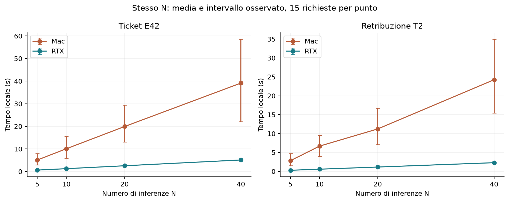
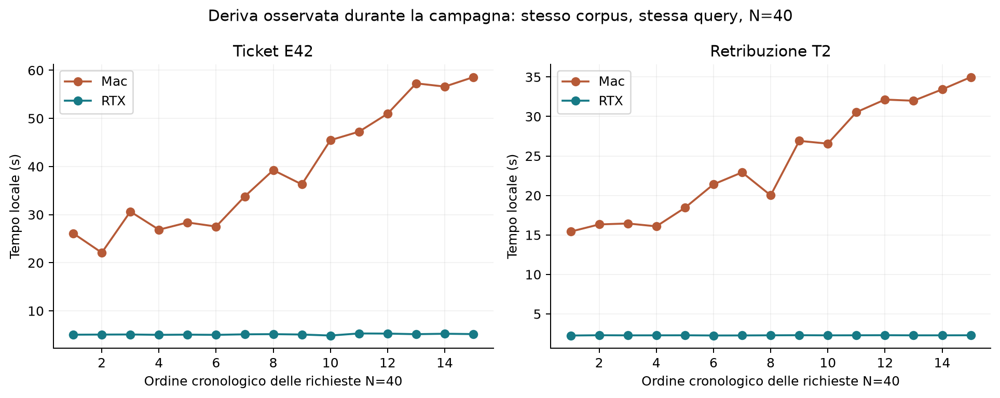
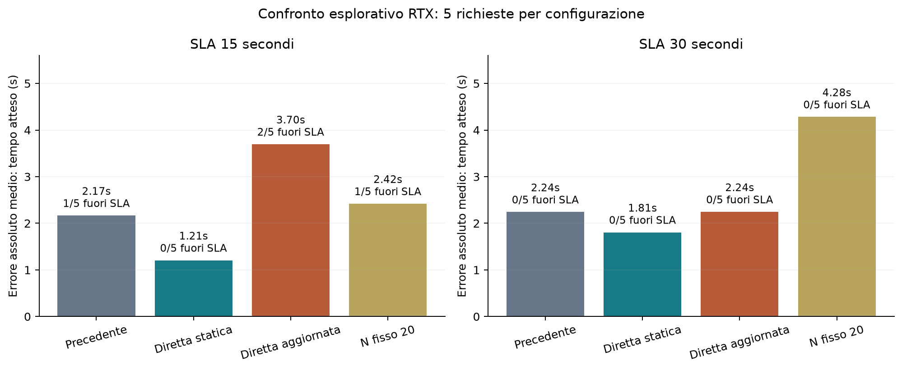
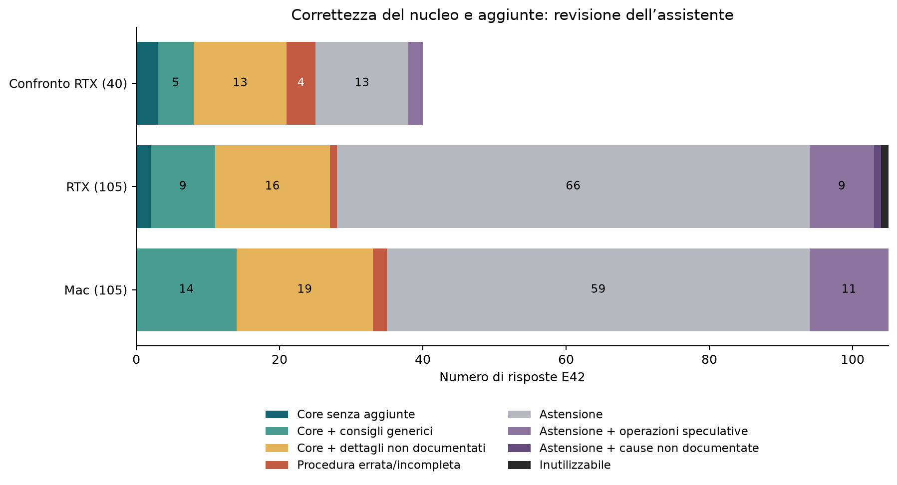
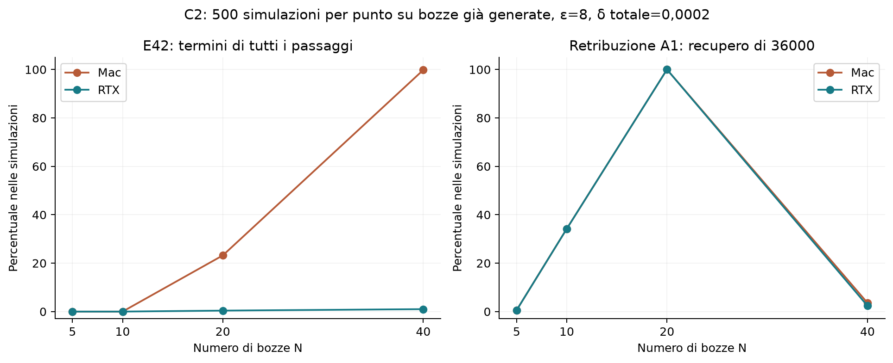

# Valutazione delle campagne Mac e RTX 2070

22 settembre 2026 · Analisi dei dati già raccolti, senza nuove chiamate cloud.

**Decisione proposta:** mantenere la stima diretta statica come candidata sulla branch `codex/stima-sla-calibrata`, senza considerarla ancora validata per uno SLA garantito. La RTX riduce molto il costo locale; il tempo cloud e la qualità della risposta restano due limiti separati. L’aggiornamento periodico della calibrazione non ha dimostrato un vantaggio nel piccolo confronto disponibile.

## 1. Dati verificati e comparabilità

| Raccolta | Richieste pipeline | Cloud reale | Cloud simulato | Simulazioni condizionali C2 | Campioni hardware |
|---|---:|---:|---:|---:|---:|
| Mac, 20 settembre | 280 | 130 | 150 | 30.000 | 1.631 |
| RTX 2070, 21 settembre | 280 | 130 | 150 | 30.000 | 357 |
| Confronto scheduler RTX | 40 | 40 | 0 | — | — |

Il rapporto originario descriveva 600 risultati e cinque file C2 per ciascuna campagna. Nel controllo aggiornato del 23 settembre 2026 sono presenti i grezzi RTX (280 richieste) e del confronto (40): tutti i 332 file attesi corrispondono al manifest e le 60 celle sono state ricalcolate. Manca l’archivio principale Mac (280 richieste); le affermazioni sulla sua completezza originaria restano registrazioni della precedente analisi. Nessun risultato contiene un errore del provider. Sono state riviste tutte le **300 risposte cloud**, corrispondenti a 290 testi distinti. Le altre 300 risposte sono simulate e non hanno una misura di correttezza cloud. I probe di calibrazione non rientrano nelle 300 risposte valutate.

Le due campagne principali hanno uguali hash del modello e dei tre corpora, uguale configurazione del modello, uguale ordine sperimentale e uguali sorgenti di scheduler, pipeline, filtro, generatore e calibrazione. Differiscono il programma di raccolta e la telemetria. Modello: Qwen2.5 0.5B Q4_K_M; contesto 4.096, limite locale 30 token, temperatura 0,2. Provider: `xiaomi/mimo-v2.5`, stesso endpoint, timeout 60 s e nessun retry.

Il confronto riguarda **due sistemi completi**, non la sola GPU: cambiano architettura, sistema operativo, backend, Python, alcune dipendenze, condizioni termiche e giorno delle chiamate cloud. La macchina RTX usa l’ambiente Linux predisposto; i sensori CPU provengono dall’host. Le bozze locali non sono identiche tra le piattaforme. La stessa configurazione non garantisce quindi lo stesso lavoro effettivo o la stessa utilità.

Provenienza conservata: [verifica originaria dei dati](verifica_dati.json) e [hash degli input](manifest_input.json). Sono disponibili i [metadata RTX](../campagna_rtx_2026-09-21/metadata.json) e i [metadata del confronto](../confronto_rtx_2026-09-21/metadata.json). Manca `campagna_2026-09-20/metadata.json`. L’[inventario degli archivi](../LEGGIMI.md) distingue queste campagne dalle raccolte complementari `mac/` e `linux/`.

## 2. Prestazioni locali e variazione nel tempo

Per confrontare le macchine uso il tempo locale a **N fisso**, senza cloud. Ogni riga comprende 15 richieste per macchina, distribuite sui tre SLA del piano. Il rapporto è tra le medie osservate; non è una misura universale della velocità della GPU.

| Caso | N | Mac, media locale (s) | RTX, media locale (s) | Rapporto Mac/RTX |
|---|---:|---:|---:|---:|
| Ticket E42 | 5 | 5,086 | 0,633 | 8,03× |
| Ticket E42 | 10 | 10,079 | 1,260 | 8,00× |
| Ticket E42 | 20 | 19,908 | 2,550 | 7,81× |
| Ticket E42 | 40 | 39,141 | 5,115 | 7,65× |
| Retribuzione T2 | 5 | 2,822 | 0,286 | 9,87× |
| Retribuzione T2 | 10 | 6,677 | 0,572 | 11,68× |
| Retribuzione T2 | 20 | 11,224 | 1,144 | 9,81× |
| Retribuzione T2 | 40 | 24,244 | 2,291 | 10,58× |

Il Mac rallenta durante la campagna. A N=40, sui ticket, le prime cinque richieste impiegano in media 26,82 s e le ultime cinque 54,14 s; i token di output visibili restano circa 1.007 e 1.011. La frequenza GPU media associata passa da 1.176 a 644 MHz. Sul caso retribuzione il tempo passa da 16,55 a 32,62 s, con circa 200 token in entrambe le finestre. È evidenza di deriva delle prestazioni associata alla frequenza, **non una prova isolata della causa termica**.

Sulla RTX, per i ticket, le corrispondenti medie sono 5,06 e 5,23 s; anche i token aumentano di circa il 3,5%. Per le retribuzioni sono 2,289 e 2,297 s. In questa campagna la RTX è molto più stabile. Una calibrazione iniziale unica descrive male la lunga esecuzione sul Mac; non basta trasferire un coefficiente medio da una macchina all’altra.

Le misure energetiche non consentono una graduatoria di efficienza: il Mac include una misura di potenza di sistema, mentre la RTX dispone di domini CPU/GPU diversi e manca l’equivalente di potenza dell’intera macchina. Non va interpretato lo zero del riepilogo di energia di sistema RTX come consumo nullo. Mancano inoltre prove dedicate, sottrazione del carico di fondo e una misura equivalente per risposta utile. I sensori sono utili per descrivere le condizioni dell’esperimento; RAM della VM e RAM dell’host non sono direttamente confrontabili.

## 3. Perché la vecchia stima SLA non è affidabile

I dati indicano tre problemi distinti.

1. **Calibrazione locale poco rappresentativa.** Le tre prove precedenti generano appena 3, 3 e 5 token e separano prefill e generazione mediante un rapporto fisso. I ticket reali arrivano spesso al limite di 30 token. La successiva deriva sul Mac peggiora lo scostamento.
2. **Probe cloud troppo breve.** Le campagne iniziali riservano circa 2,34 s sul Mac e 1,92 s sulla RTX, mentre molte chiamate reali richiedono 7–13 s o più. Anche una macchina locale molto veloce non elimina questo costo.
3. **Fallback non equivalente a una scadenza rispettata.** Con N=0 viene comunque chiamato il cloud. Nel blocco B tutte le 40 richieste di ciascuna macchina sforano, senza alcun rilascio di keyword o procedura E42 corretta. La tolleranza `k=0,25` o `0,5` attiva cinque inferenze locali, ma non produce un miglioramento di utilità osservato. Gli SLA del blocco B sono diversi fra macchine (5,380 s e 2,540 s), perché costruiti rispetto alle rispettive stime: non sono un confronto a deadline identica.

Nel blocco cloud ad alto epsilon, usando lo scheduler adattivo:

| Sistema | SLA | N | Tempo medio totale | Locale | Cloud | Sforamenti | Nucleo E42 corretto e nei tempi |
|---|---:|---:|---:|---:|---:|---:|---:|
| Mac | 15 s | 18 | 33,90 s | 24,88 s | 9,02 s | 5/5 | 0/5 |
| Mac | 30 s | 39 | 84,31 s | 75,18 s | 9,12 s | 5/5 | 0/5 |
| RTX | 15 s | 40 | 15,38 s | 5,13 s | 10,24 s | 2/5 | 2/5 |
| RTX | 30 s | 40 | 12,95 s | 5,14 s | 7,80 s | 0/5 | 5/5 |

Questo blocco mostra il limite pratico, ma non sostituisce il confronto controllato delle quattro varianti descritto sotto. La calibrazione precedente sulla RTX può anche **sovrastimare** il solo tempo locale: nel blocco offline ticket adattivo a 15 s la previsione è circa 8,23 s contro 5,18 s reali. L’errore totale nasce da componenti con segni opposti; correggerlo con un unico moltiplicatore sarebbe fragile.

Il blocco C4 contiene otto decisioni per macchina, senza eseguire nuove richieste: conferma che la calibrazione cambia N (a 15 s: default N=0, calibrato Mac N=21, calibrato RTX N=40), ma non dimostra che i piani rispettino i tempi. Nel blocco offline rimane nella vecchia stima una riserva cloud di 0,2 s, pur essendo il cloud simulato.

## 4. Valutazione della nuova stima

Il confronto sulla RTX contiene quattro varianti, due SLA e cinque ripetizioni per cella, con ordine mescolato. Epsilon=8 e delta PTR=0,01. La stima diretta locale usa sei prove pubbliche con il limite operativo di output, di cui quattro producono 30 token; il cloud usa tre chiamate rappresentative. Media e massimo osservato sono salvati separatamente come tempo atteso e valore prudenziale per pianificare N.

La tabella usa **MAE rispetto al tempo atteso**. Gli sforamenti confrontano invece il tempo reale con lo SLA. “Nucleo corretto” richiede arresto del servizio → cancellazione cache → riavvio, nell’ordine; può ancora contenere aggiunte non documentate.

| Variante | SLA | N medio | MAE | Sforamenti | Rilascio keyword | Nucleo corretto nei tempi |
|---|---:|---:|---:|---:|---:|---:|
| Precedente | 15 s | 40 | 2,17 s | 1/5 | 4/5 | 3/5 |
| Diretta statica | 15 s | 31 | 1,21 s | 0/5 | 2/5 | 2/5 |
| Diretta aggiornata | 15 s | 29,8 | 3,70 s | 2/5 | 3/5 | 3/5 |
| N fisso 20 | 15 s | 20 | 2,42 s | 1/5 | 1/5 | 0/5 |
| Precedente | 30 s | 40 | 2,24 s | 0/5 | 5/5 | 3/5 |
| Diretta statica | 30 s | 40 | 1,81 s | 0/5 | 4/5 | 3/5 |
| Diretta aggiornata | 30 s | 40 | 2,24 s | 0/5 | 5/5 | 5/5 |
| N fisso 20 | 30 s | 20 | 4,28 s | 0/5 | 2/5 | 2/5 |

La **diretta statica riduce il MAE del 44% a 15 s e del 19% a 30 s** rispetto alla precedente. Nessuna delle dieci richieste supera neppure il valore prudenziale pianificato. Il bias rispetto al tempo atteso è +0,54 s a 15 s e −1,81 s a 30 s: a 30 s rimane conservativa. A 15 s compra margine riducendo N da 40 a 31, ma nel campione il nucleo corretto scende da 3/5 a 2/5. Non è quindi un miglioramento dimostrato su tutte le dimensioni.

La variante aggiornata effettua **un solo aggiornamento locale**, prima di `run_024`, per circa 0,70 s, e non aggiorna la stima cloud. Nei due sforamenti successivi il cloud da solo richiede 14,87 e 16,00 s; i totali sono 18,63 e 19,68 s. La componente locale resta circa 3,7 s. Questa evidenza non giustifica attribuire il peggioramento alla ricalibrazione locale; mostra soprattutto che il margine cloud non copre queste chiamate. Il massimo sforamento è 4,68 s, contro appena 0,049 s della variante precedente a 15 s: il solo conteggio degli sforamenti nasconde una differenza importante.

Il confronto cambia contemporaneamente la calibrazione locale e cloud, quindi non isola quale modifica produca il beneficio. Non contiene una prova della nuova stima sul Mac. Con cinque osservazioni per cella, 0/5 sforamenti non certifica un tasso basso: anche assumendo prove indipendenti e stazionarie, il limite superiore Wilson al 95% è circa 43%. Il massimo di sei/tre probe **non è un percentile 95 validato**. I tempi di inizializzazione e dei probe sono separati dal tempo della richiesta; il refresh registrato non va nascosto se un domani ricade nel percorso percepito dall’utente.

## 5. Rilascio del filtro, correttezza e utilità

### Metodo della revisione

La valutazione semantica è stata svolta dall’assistente, usando i casi e i ticket di riferimento locali. Non è una revisione umana indipendente, né una misura di accordo tra valutatori. I 290 testi distinti sono stati letti e classificati; i duplicati esatti dello stesso caso condividono il giudizio. Ogni giudizio rimanda ai file grezzi e conserva l’hash della risposta. Nessun campo di qualità dei dati originali è stato riscritto.

Per E42 distinguo: nucleo corretto; nucleo con consigli generici; nucleo con dettagli/operazioni non documentati; procedura incompleta o disordinata; astensione; astensione con interventi speculativi; risposta inutilizzabile. Una risposta può avere il nucleo corretto ma non essere accettabile come istruzione operativa. Per il Super Bowl valuto il vincitore richiesto, non certifico tutti i fatti accessori aggiunti. Una risposta che dice Patriots e poi Broncos in nota è contraddittoria, non corretta.

| Esito E42 | Mac (105) | RTX (105) | Confronto RTX (40) |
|---|---:|---:|---:|
| Nucleo corretto, incluse aggiunte | 33 | 27 | 21 |
| Di cui senza aggiunte materiali, ammessi consigli generici | 14 | 11 | 8 |
| Di cui senza alcuna aggiunta, criterio rigoroso | 0 | 2 | 3 |
| Procedura incompleta/ordine errato | 2 | 1 | 4 |
| Astensione senza operazioni speculative | 59 | 66 | 13 |
| Astensione con operazioni speculative o cause non documentate | 11 | 10 | 2 |
| Risposta degenerata | 0 | 1 | 0 |

Le prime tre righe sono **sottoinsiemi**, non categorie da sommare. Le proporzioni complessive dipendono dal mix sperimentale, che include 40 prove B deliberatamente difficili per ciascuna campagna. Non sono accuratezze di produzione né prova che il Mac generi risposte migliori della RTX. Contando insieme correttezza del nucleo E42 e SLA si ottengono 1/105 sul Mac, 25/105 sulla RTX e 21/40 nel confronto; per i confronti fra varianti servono le celle omogenee della sezione precedente.

Sono emersi errori concreti: rimozione del programma al posto del riavvio (`R264`), cancellazione di log/configurazioni non prevista dal ticket (`R079`), ordine dei passaggi invertito e suggerimenti di rollback senza fonte. `R216` è una lunga ripetizione di caratteri, non un errore HTTP: **successo del provider non equivale a risposta valida**. Nel confronto, `R290` ha etichetta grezza “completo” ma riceve solo la keyword `servizio` e si astiene. Quell’etichetta non misura la correttezza della procedura.

Per gli altri casi:

| Caso | Mac | RTX | Interpretazione |
|---|---:|---:|---|
| Vincitore Super Bowl 50 | 9/10 corretti | 7/10 corretti | RTX: un errore e due contraddizioni; conoscenza pubblica può compensare keyword mancanti/sbagliate |
| E99 assente dai ticket | 2/5 astensioni corrette | 3/5 astensioni corrette | Nelle altre risposte la procedura E42 viene attribuita a E99 senza riscontro |
| Identificativo condiviso | 5/5 esatti | 4/5 esatti | Una risposta RTX tronca `clusterinternoaurora` in `Aurora` |
| Codice privato del ticket | 5/5 astensioni | 5/5 astensioni | Nessun codice inventato; domanda priva del ticket specifico, esclusa dall’accuratezza con target univoco |

Il caso Super Bowl non è una prova forte di utilità del retrieval: ci sono risposte corrette senza rilascio e una correzione delle keyword Patriots tramite conoscenza generale (`R020`). Il caso E99 è invece utile a mostrare che il consenso sulle parole non certifica la pertinenza rispetto alla domanda.

L’intera revisione, con risposte e motivazioni, è in [RISPOSTE_COMMENTATE.md](RISPOSTE_COMMENTATE.md); la tabella per tutte le 300 richieste è in [valutazioni_risposte.csv](valutazioni_risposte.csv).

### Che cosa mostrano le simulazioni C2

Ogni punto C2 riusa bozze locali già generate e ripete 500 volte il filtro. Le 60.000 prove complessive **non sono 60.000 richieste indipendenti alla pipeline**. Gli intervalli descrivono la casualità del filtro condizionata a quelle bozze, non l’incertezza completa del sistema.

- Su E42, N=40 ed epsilon=8, delta totale 0,0002, il rilascio di tutti i gruppi di termini è 99,8% sul Mac e 1,0% sulla RTX. Le bozze differiscono: il riavvio compare in 29/40 bozze Mac contro 21/40 RTX; 15/40 e 25/40 bozze arrivano al limite di 30 token. Questa forte differenza impedisce di trattare C2 come un confronto del filtro a istogramma identico. È compatibile con sensibilità alla generazione/troncamento, da isolare in una verifica futura.
- Nel caso retribuzione A1, N=20 recupera il target 36000 nel 100% delle simulazioni con epsilon=8, mentre N=40 scende al 3,6% sul Mac e al 2,4% sulla RTX. Le venti bozze aggiunte contengono 13 volte 42000 e 7 volte 30000: includere altri reparti riduce la separazione del target. Massimizzare N non massimizza automaticamente l’utilità.
- L’identificativo condiviso viene rilasciato nel 100% delle simulazioni a N=40 ed epsilon=4/8 su entrambe le macchine. Non è una violazione dimostrata della DP per documento: una proprietà ripetuta su molti documenti può essere stabile. Serve una politica separata se quel dato deve restare riservato.
- Nei test del dettaglio unico non si osserva il rilascio del codice, ma zero eventi in questi campioni non prova impossibilità di divulgazione né certifica la privacy.

I risultati C2 non vanno confrontati direttamente con le frequenze cloud ad alto epsilon: lì delta PTR è 0,01, mentre C2 riporta delta totale 0,0002. Sono impostazioni diverse. La campagna è diagnostica su dati pubblici/sintetici: nel confronto l’account cumulativo riporta epsilon circa 209,46 e delta 0,41. Questi numeri non supportano una promessa pratica di forte privacy per l’intera sessione. L’assenza di identificativi osservati e i log stessi non sostituiscono le ipotesi e l’accounting descritti in [PRIVACY_ACCOUNTING.md](../../docs/PRIVACY_ACCOUNTING.md).

## 6. Decisioni operative e conclusioni

**Sullo scheduler:** la direzione corretta è stimare separatamente costo locale, cloud e overhead; mantenere distinto il tempo atteso dal margine usato per ammettere una richiesta. La variante statica è la base sperimentale più promettente per l’accuratezza temporale sulla RTX. L’aggiornamento periodico resta un’ipotesi da verificare, particolarmente interessante per la deriva del Mac, ma non viene promosso sulla base di queste cinque ripetizioni.

**Sul comportamento entro SLA:** se il budget residuo non può contenere una chiamata cloud credibile, N=0 con chiamata cloud non risolve il problema. Occorre progettare un esito locale rapido di indisponibilità oppure una modalità esplicitamente differita. La deadline va misurata sul percorso completo percepito dall’utente. Questo è un intervento successivo proposto, non una modifica già applicata.

**Sulla qualità:** adottare una misura congiunta “risposta corretta entro SLA”, affiancata da “senza aggiunte non documentate”, conservando rilascio PTR e disponibilità del provider come indicatori separati. Per istruzioni come E42 servono risposte più vincolate ai passaggi documentati e un controllo delle risposte degeneri. Per E99 serve astensione quando le informazioni non rispondono alla domanda. Aumentare epsilon o N non sostituisce questi controlli.

**Sulla selezione di N:** il caso A1 mostra il valore di un recupero più pertinente; non giustifica però scegliere N guardando liberamente conteggi o contenuti privati. Qualsiasi nuova regola adattiva deve rispettare le assunzioni di privacy documentate. Anche aggiornamenti da tempi reali dipendenti dai documenti non vanno dichiarati automaticamente pubblici: mantenere probe pubblici o motivare esplicitamente il nuovo meccanismo.

I risultati sostengono queste conclusioni:

1. A parità di N, nelle condizioni osservate, la piattaforma RTX riduce nettamente e stabilizza il tempo locale; il vantaggio totale è limitato dalla componente cloud.
2. La calibrazione iniziale e il probe cloud della versione precedente non rappresentano adeguatamente la distribuzione dei tempi reali.
3. La stima diretta statica riduce l’errore medio nel confronto RTX disponibile, con un possibile costo di utilità quando restringe N; la sua generalizzazione al Mac e la copertura delle code di latenza restano da validare.
4. Rilascio differenzialmente privato, pertinenza, correttezza e rispetto dello SLA sono proprietà diverse; il benchmark le deve presentare separatamente.

**L’unica nuova prova che proporrei dopo questa analisi** è una verifica mirata: precedente contro diretta statica, stesso caso e limite di risposta, ordine mescolato, sulla RTX e sul Mac già caldo, con calibrazione separata dalla valutazione. Aggiungerei un confronto a N fisso per separare accuratezza della stima ed effetto della scelta di N. Numero di ripetizioni e soglia di accettazione andrebbero fissati prima del test; non avvio un’altra campagna automaticamente.

## 7. File per riprodurre e controllare i risultati

- [Metriche principali](metriche.json) e [tutte le 112 celle sperimentali](celle.csv).
- [Risposte valutate](valutazioni_risposte.csv) e [testi distinti](risposte_uniche.json). `richieste.csv` e `annotazioni.json` non sono presenti nella copia attuale.
- [Tutte le 120 celle C2](C2_condizionale.csv), con intervalli già disponibili nelle analisi originarie.
- [Script di riproduzione originario](analizza.py): richiede anche l’archivio grezzo Mac e `annotazioni.json`, attualmente mancanti. Per il confronto aggiornato e interamente verificabile consultare il [rapporto corrente](../valutazione_mac_rtx_2026-09-26/RAPPORTO_COMPARATIVO.md) e il [verificatore](../../scripts/verify_experiments.py). Quest’ultimo verifica anche la conservazione dei dati RTX e del confronto presenti in questa analisi storica, senza eseguire inferenze.

Le valutazioni sono una prima revisione motivata e tracciabile: prima della redazione definitiva del capitolo, i giudizi semantici più discutibili possono essere verificati da un secondo valutatore. I risultati quantitativi sono descrittivi di queste campagne, con campioni piccoli e osservazioni temporalmente correlate; non sono garanzie di servizio o di privacy.
