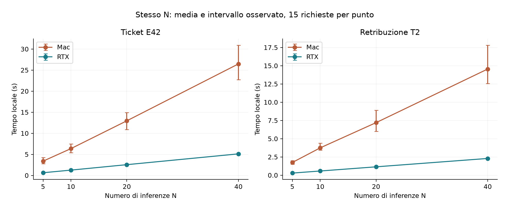
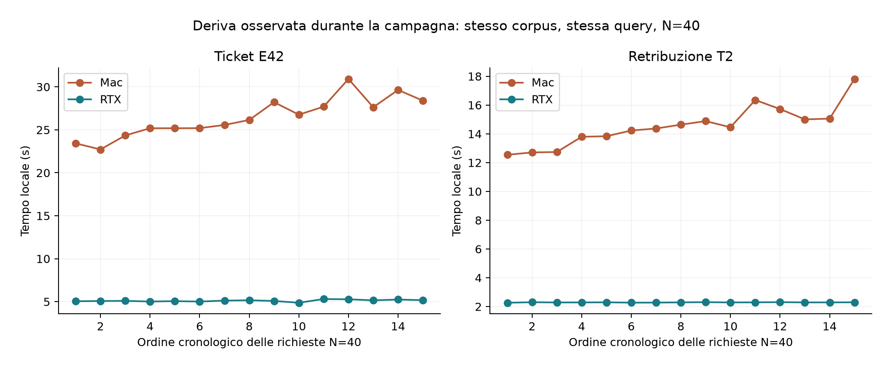
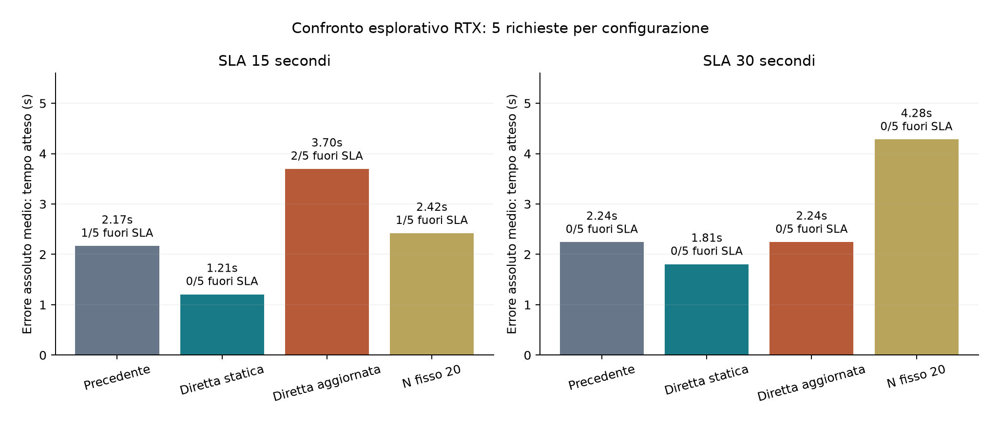
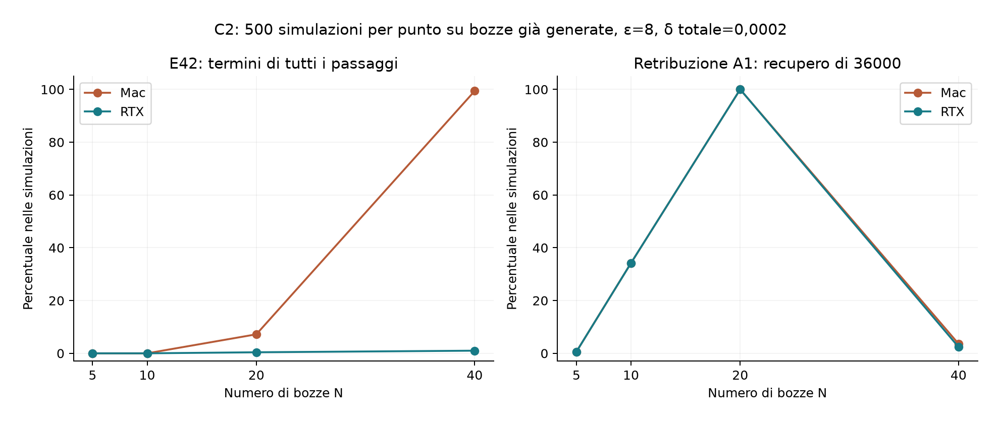
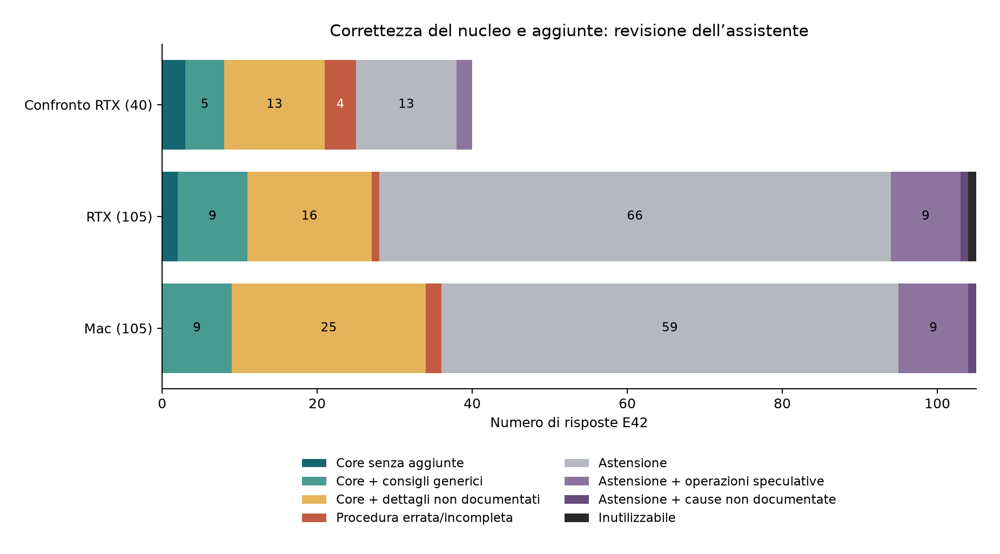

# Valutazione delle campagne Mac e RTX — replica Mac del 26 settembre 2026

Il confronto principale usa la nuova campagna Mac del 26 settembre e le campagne RTX e confronto degli stimatori del 21 settembre. Sono nuove soltanto le misure Mac. L'archivio Mac del 20 settembre resta mancante: i suoi aggregati sono conservati nel [rapporto storico](../valutazione_mac_rtx_2026-09-22/RAPPORTO_COMPARATIVO.md), senza essere mescolati alla replica.

## Dati e provenienza

| Raccolta | Richieste | Cloud reale | Cloud simulato | Repliche C2 | Campioni hardware |
|---|---:|---:|---:|---:|---:|
| Mac | 280 | 130 | 150 | 30000 | 1031 |
| RTX | 280 | 130 | 150 | 30000 | 357 |
| Confronto | 40 | 40 | 0 | 0 | 0 |

Sono conservati i grezzi delle 600 richieste usate nel confronto, le 112 celle, le 120 celle C2 e i 300 giudizi riferiti a 292 testi distinti. Errori del provider: Mac 0, RTX 0, Confronto 0.

La replica utilizza sorgenti archiviate del commit `8b770e0`. Gli hash dei componenti sperimentali principali coincidono con quelli nei metadata RTX; runner e telemetria differiscono. Modello, configurazione e corpus sono uguali secondo i rispettivi hash. Le versioni dei pacchetti e le condizioni reali vengono registrate nuovamente: il metadata Mac originale manca, quindi non si certifica l'identità completa dell'ambiente del 20 settembre.

Modello locale Qwen2.5 0.5B Q4_K_M, contesto 4.096, limite di 30 token e temperatura 0,2. Provider `xiaomi/mimo-v2.5` su `api.commandcode.ai`, timeout 60 secondi, zero retry. Solo dati sintetici o pubblici. Report, bozze, tempi e telemetria non sono output DP.

| Ambiente | Mac replica | RTX originale |
|---|---|---|
| Piattaforma | macOS-26.6.2-arm64-arm-64bit-Mach-O | Linux-6.8.0-139-generic-x86_64-with-glibc2.39 |
| Python | 3.13.2 | 3.12.3 |
| llama-cpp-python | 0.3.35 | 0.3.35 |
| numpy | 2.5.2 | 2.5.3 |
| openai | 3.8.0 | 3.14.1 |
| langfuse | 4.15.1 | 4.15.4 |

Il confronto è fra sistemi completi osservati in giorni diversi; non isola la GPU e non controlla il carico del provider. Il seed governa l'ordine delle prove, non garantisce identità delle risposte o del rumore della pipeline.

Fonti: [protocollo della replica](../../misurazioni/REPLICA_MAC_2026-09-26.md), [provenienza dei sorgenti](../replica_mac_2026-09-26_sorgenti/provenienza.json), [manifest dei dati](manifest_input.json), [metadata Mac](../campagna_mac_replica_2026-09-26/metadata.json), [metadata RTX](../campagna_rtx_2026-09-21/metadata.json).

## Tempi locali a N fisso

Ogni valore comprende 15 richieste offline, distribuite sui tre SLA. Il rapporto usa le medie della componente locale.

| Caso | N | Mac (s) | RTX (s) | Mac/RTX |
|---|---:|---:|---:|---:|
| Procedura E42 | 5 | 3,385 | 0,633 | 5,35 |
| Procedura E42 | 10 | 6,365 | 1,260 | 5,05 |
| Procedura E42 | 20 | 12,959 | 2,550 | 5,08 |
| Procedura E42 | 40 | 26,470 | 5,115 | 5,17 |
| Retribuzione T2 | 5 | 1,737 | 0,286 | 6,08 |
| Retribuzione T2 | 10 | 3,743 | 0,572 | 6,55 |
| Retribuzione T2 | 20 | 7,197 | 1,144 | 6,29 |
| Retribuzione T2 | 40 | 14,546 | 2,291 | 6,35 |

### Variazione durante le campagne

Prime e ultime cinque richieste a N=40 per corpus; le frequenze sono medie sui campioni hardware che ricadono nelle finestre delle richieste. Il confronto è osservazionale.

| Piattaforma | Caso | Finestra | Locale (s) | Token visibili | Frequenza GPU (MHz) |
|---|---|---|---:|---:|---:|
| Mac | ticket | first_five | 24,17 | 1031,2 | 1273 |
| Mac | ticket | last_five | 28,86 | 1043,4 | 1029 |
| Mac | salary | first_five | 13,13 | 200,0 | 1242 |
| Mac | salary | last_five | 15,99 | 200,2 | 975 |
| RTX | ticket | first_five | 5,06 | 1023,4 | 1848 |
| RTX | ticket | last_five | 5,23 | 1059,2 | 1812 |
| RTX | salary | first_five | 2,29 | 200,4 | 1778 |
| RTX | salary | last_five | 2,30 | 200,2 | 1785 |

## Pianificazione e cloud

I probe iniziali misurano 3,465 s per Mac, 1,920 s per RTX. Hanno limite di 16 token, contro 1.024 per le risposte. Gli otto calcoli C4 per macchina sono decisioni senza nuove richieste alla pipeline.

| Piattaforma | SLA C4 (s) | N predefinito | N calibrato |
|---|---:|---:|---:|
| Mac | 1,5 | 0 | 0 |
| Mac | 5,0 | 0 | 8 |
| Mac | 15,0 | 0 | 25 |
| Mac | 30,0 | 6 | 40 |
| RTX | 1,5 | 0 | 6 |
| RTX | 5,0 | 0 | 23 |
| RTX | 15,0 | 0 | 40 |
| RTX | 30,0 | 6 | 40 |

Le decisioni C4 mantengono il costo cloud predefinito e isolano il cambiamento dei coefficienti locali. Le richieste C3 seguenti includono invece il probe della piattaforma.

| Piattaforma | SLA (s) | N | Totale (s) | Locale (s) | Cloud (s) | Sforamenti | Nucleo entro SLA |
|---|---:|---:|---:|---:|---:|---:|---:|
| Mac | 15 | 20 | 25,04 | 12,19 | 12,84 | 5/5 | 0/5 |
| Mac | 30 | 40 | 41,01 | 23,93 | 17,08 | 5/5 | 0/5 |
| RTX | 15 | 40 | 15,38 | 5,13 | 10,24 | 2/5 | 2/5 |
| RTX | 30 | 40 | 12,95 | 5,14 | 7,80 | 0/5 | 5/5 |

Il confronto degli stimatori resta quello RTX conservato, con cinque richieste per cella. Il MAE usa il tempo atteso; lo SLA e la previsione prudenziale sono controlli distinti.

| Variante | SLA (s) | N medio | MAE (s) | Sforamenti | Rilasci | Nucleo entro SLA |
|---|---:|---:|---:|---:|---:|---:|
| direct_refresh | 15 | 29.8 | 3,70 | 2/5 | 3/5 | 3/5 |
| direct_refresh | 30 | 40 | 2,24 | 0/5 | 5/5 | 5/5 |
| direct_static | 15 | 31 | 1,21 | 0/5 | 2/5 | 2/5 |
| direct_static | 30 | 40 | 1,81 | 0/5 | 4/5 | 3/5 |
| fixed_20 | 15 | 20 | 2,42 | 1/5 | 1/5 | 0/5 |
| fixed_20 | 30 | 20 | 4,28 | 0/5 | 2/5 | 2/5 |
| legacy | 15 | 40 | 2,17 | 1/5 | 4/5 | 3/5 |
| legacy | 30 | 40 | 2,24 | 0/5 | 5/5 | 3/5 |

La stima diretta statica riduce il MAE rispetto alla precedente di circa il 44% a 15 secondi e il 19% a 30 secondi nel confronto RTX. A 15 secondi riduce N da 40 a 31 e i nuclei corretti entro SLA passano da tre a due su cinque. Non è dimostrata una superiorità generale. La replica Mac misura lo scheduler storico e non estende al Mac la validazione della stima diretta.

### Tolleranza sul piano minimo

| Piattaforma | SLA (s) | k | N medio | Sforamenti | Nuclei corretti |
|---|---:|---|---:|---:|---:|
| Mac | 5,631 | k_0 | 0 | 10/10 | 0/10 |
| Mac | 5,631 | k_0.1 | 0 | 10/10 | 0/10 |
| Mac | 5,631 | k_0.25 | 5 | 10/10 | 0/10 |
| Mac | 5,631 | k_0.5 | 5 | 10/10 | 0/10 |
| RTX | 2,540 | k_0 | 0 | 10/10 | 0/10 |
| RTX | 2,540 | k_0.1 | 0 | 10/10 | 0/10 |
| RTX | 2,540 | k_0.25 | 5 | 10/10 | 0/10 |
| RTX | 2,540 | k_0.5 | 5 | 10/10 | 0/10 |

Le scadenze B derivano dalla calibrazione e dal probe di ogni macchina e quindi differiscono. Il fallback N=0 continua a chiamare il cloud.

## Filtro condizionale e bozze

Ogni cella C2 comprende 500 repliche del filtro su bozze congelate, con delta totale 0,0002. Non sono nuove richieste ai modelli e non formano una sessione protetta di 60.000 interrogazioni.

| Piattaforma | Caso | N | ε | Almeno una parola | Tutti i gruppi E42 / target |
|---|---|---:|---:|---:|---:|
| Mac | base_a | 20 | 4 | 59,8% | 59,8% |
| Mac | base_a | 20 | 8 | 100,0% | 100,0% |
| Mac | base_a | 40 | 4 | 0,2% | 0,2% |
| Mac | base_a | 40 | 8 | 3,6% | 3,6% |
| Mac | dettaglio_condiviso | 20 | 4 | 58,2% | n.a. |
| Mac | dettaglio_condiviso | 20 | 8 | 100,0% | n.a. |
| Mac | dettaglio_condiviso | 40 | 4 | 100,0% | n.a. |
| Mac | dettaglio_condiviso | 40 | 8 | 100,0% | n.a. |
| Mac | errore_assente | 20 | 4 | 1,2% | n.a. |
| Mac | errore_assente | 20 | 8 | 20,8% | n.a. |
| Mac | errore_assente | 40 | 4 | 47,4% | n.a. |
| Mac | errore_assente | 40 | 8 | 100,0% | n.a. |
| Mac | procedura_e42 | 20 | 4 | 0,0% | 0,0% |
| Mac | procedura_e42 | 20 | 8 | 7,2% | 7,2% |
| Mac | procedura_e42 | 40 | 4 | 33,4% | 33,4% |
| Mac | procedura_e42 | 40 | 8 | 99,4% | 99,4% |
| RTX | base_a | 20 | 4 | 52,2% | 52,2% |
| RTX | base_a | 20 | 8 | 100,0% | 100,0% |
| RTX | base_a | 40 | 4 | 0,2% | 0,2% |
| RTX | base_a | 40 | 8 | 2,4% | 2,4% |
| RTX | dettaglio_condiviso | 20 | 4 | 58,2% | n.a. |
| RTX | dettaglio_condiviso | 20 | 8 | 100,0% | n.a. |
| RTX | dettaglio_condiviso | 40 | 4 | 100,0% | n.a. |
| RTX | dettaglio_condiviso | 40 | 8 | 100,0% | n.a. |
| RTX | errore_assente | 20 | 4 | 0,2% | n.a. |
| RTX | errore_assente | 20 | 8 | 1,4% | n.a. |
| RTX | errore_assente | 40 | 4 | 1,0% | n.a. |
| RTX | errore_assente | 40 | 8 | 33,0% | n.a. |
| RTX | procedura_e42 | 20 | 4 | 0,0% | 0,0% |
| RTX | procedura_e42 | 20 | 8 | 0,4% | 0,4% |
| RTX | procedura_e42 | 40 | 4 | 2,4% | 0,0% |
| RTX | procedura_e42 | 40 | 8 | 32,8% | 1,0% |

Mac: 25/40 bozze E42 contengono un riferimento lessicale al riavvio; 13/40 raggiungono 30 token. Le bozze complete sono conservate nei file C2. Questi conteggi descrivono il testo e non attribuiscono causalmente le differenze al troncamento.

Mac, controllo salariale A1: le venti bozze aggiunte passando da N=20 a N=40 contengono 13 volte `42000`; 7 volte `30000`. Sono valori degli altri reparti, distinti dal target 36.000.

RTX: 21/40 bozze E42 contengono un riferimento lessicale al riavvio; 25/40 raggiungono 30 token. Le bozze complete sono conservate nei file C2. Questi conteggi descrivono il testo e non attribuiscono causalmente le differenze al troncamento.

RTX, controllo salariale A1: le venti bozze aggiunte passando da N=20 a N=40 contengono 13 volte `42000`; 7 volte `30000`. Sono valori degli altri reparti, distinti dal target 36.000.

Il rilascio di un termine condiviso non equivale a una violazione dimostrata della privacy per documento. Allo stesso modo, rilasciare parole per E99 non prova che la procedura richiesta sia presente nei documenti.

## Utilità delle risposte

La revisione è dell'assistente, non di un valutatore umano indipendente. I giudizi RTX e confronto sono conservati; quelli nuovi sono collegati ai testi Mac nella [revisione commentata](RISPOSTE_COMMENTATE.md). Le etichette automatiche non sostituiscono la lettura semantica.

| Piattaforma | Caso | Risposte | Successi valutabili | Successi entro SLA | E42 senza aggiunte materiali |
|---|---|---:|---:|---:|---:|
| Mac | dettaglio_condiviso | 5 | 3/5 | 3 | n.a. |
| Mac | dettaglio_unico | 5 | non valutabile | 0 | n.a. |
| Mac | errore_assente | 5 | 3/5 | 3 | n.a. |
| Mac | procedura_e42 | 105 | 34/105 | 7 | 9 |
| Mac | super_bowl | 10 | 8/10 | 8 | n.a. |
| RTX | dettaglio_condiviso | 5 | 4/5 | 4 | n.a. |
| RTX | dettaglio_unico | 5 | non valutabile | 0 | n.a. |
| RTX | errore_assente | 5 | 3/5 | 3 | n.a. |
| RTX | procedura_e42 | 105 | 27/105 | 25 | 11 |
| RTX | super_bowl | 10 | 7/10 | 7 | n.a. |
| Confronto | procedura_e42 | 40 | 21/40 | 21 | 8 |

Il nucleo E42 richiede arresto, cancellazione della cache e riavvio nell'ordine previsto. La categoria C_extra ammette il nucleo ma segnala dettagli o operazioni non documentati; non equivale a una procedura affidabile da eseguire. Il codice individuale ha target ambiguo e resta escluso dal denominatore di correttezza.

## Rapporto con la campagna Mac perduta

La tabella seguente confronta i nuovi tempi locali con gli aggregati storici conservati, a fini di trasparenza. La colonna storica non è ricalcolabile dai grezzi Mac originari e non entra nelle tabelle del nuovo confronto.

| Caso | N | Mac 20 settembre, aggregato storico (s) | Mac 26 settembre, nuovi grezzi (s) |
|---|---:|---:|---:|
| ticket | 5 | 5,086 | 3,385 |
| ticket | 10 | 10,079 | 6,365 |
| ticket | 20 | 19,908 | 12,959 |
| ticket | 40 | 39,141 | 26,470 |
| salary | 5 | 2,822 | 1,737 |
| salary | 10 | 6,677 | 3,743 |
| salary | 20 | 11,224 | 7,197 |
| salary | 40 | 24,244 | 14,546 |

## Limiti e riproduzione

Il confronto degli stimatori registra un consumo cumulativo ε=209,46 e δ=0,41, nei [metadata originali](../confronto_rtx_2026-09-21/metadata.json). Questi valori diagnostici su dati sintetici non descrivono una forte protezione per un’intera sessione con dati riservati.

Cinque ripetizioni per molte celle consentono una descrizione esplorativa, non garanzie di servizio. La variabilità del provider, le condizioni del Mac e le differenze fra backend rimangono confondenti. I giudizi semantici richiedono revisione umana; tempi, hardware e report sono fuori dalla garanzia DP. Le impostazioni diagnostiche e i budget cumulativi non sono raccomandazioni per dati riservati.

Per ricalcolare i risultati senza nuove inferenze: eseguire `analizza.py` e `genera_rapporto.py` in questa cartella con l'ambiente Python del progetto. `annotazioni.json` conserva i giudizi, `risposte_uniche.json` i testi, `manifest_input.json` gli hash delle fonti. Il programma `poc/scripts/verify_experiments.py` ricalcola le celle dai 600 grezzi e verifica hash, annotazioni, corpora e provenienza.
